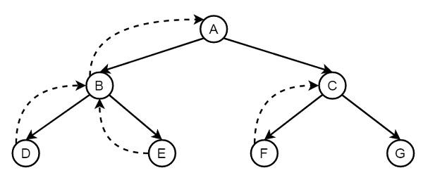

# Backtracking

- Backtracking is an algorithmic-technique for solving problems recursively by trying to build a solution incrementally and removing those solutions that fail to satisfy the constraints of the problem.

**Backtracking can be defined as a general algorithmic technique that considers searching every possible combination in order to solve a computational problem.**

- Its basically trying different paths till the dead-end comes.

- It is commonly used in situations where you need to explore multiple possibilities to solve a problem

[Backtracking by Abdul Bari](https://www.youtube.com/watch?v=DKCbsiDBN6c)
