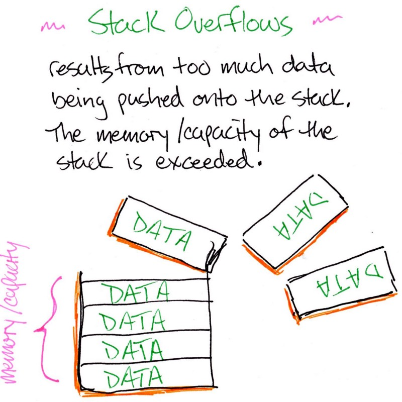

# Recursion

<div align="center">
  
</div>

- Recursion occurs when a function calls itself until a certain condition is met.
- It is a way to solve problems by breaking them down into smaller instances of the same problem.
- Recursion is often used when a problem can be divided into smaller problems, and the same solution applies to each of them.
- **_When a function calls itself recursively without an exit condition, it can cause a stack overflow._**
- A stack is a data structure that stores information about function calls.
- If the stack becomes too large, it can cause a stack overflow.
- This issue is common in languages like C and C++ because they lack automatic memory management.
- To avoid stack overflow in recursive functions, you need to have a base case that ends the recursion.
- A base case is essentially an exit condition for the recursive function where the function stops calling itself.

> [!NOTE]  
> Including a `return` statement in a recursive function is important because it allows the function to return a value and end the recursion.

```c++
// Recursion Example
#include <iostream>
using namespace std;

int count = 0;
void recursion() {
    if (count == 3) return;
    count++;
    recursion();
}

int main() {
    recursion();
    return 0;
}
```

## Why do we need Recursion?

- With the help of recursion, a task can be divided into smaller tasks of the same nature.
- To perform a task multiple times with different values.

## Recursion Tree

- Recursion tree is a tree that represents the function calls and the return values.
- It's useful to understand the flow of the recursion and to understand the stack overflow.

## Algorithmic steps for recursion

1. **Base Case**: The condition that stops the recursion.
2. **Recursive Case**: The condition that calls the function again.
3. **Recursive Statement**: The statement that calls the function again.
4. **Recursive Call**: The call to the function itself.
5. **Return Statement**: The statement that returns the value to the calling function.

## Tail Recursion

- When a recursive function calls itself as the last operation, it's called tail recursion.
- Tail recursion can be optimized by the compiler to avoid stack overflow.
- Tail recursion is a special case of recursion where the recursive call is the last operation in the function.
